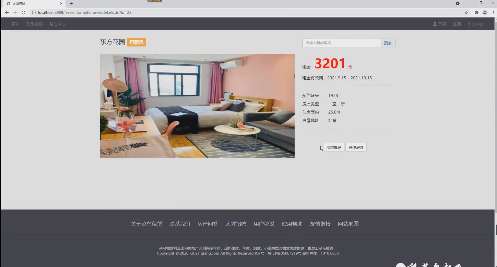
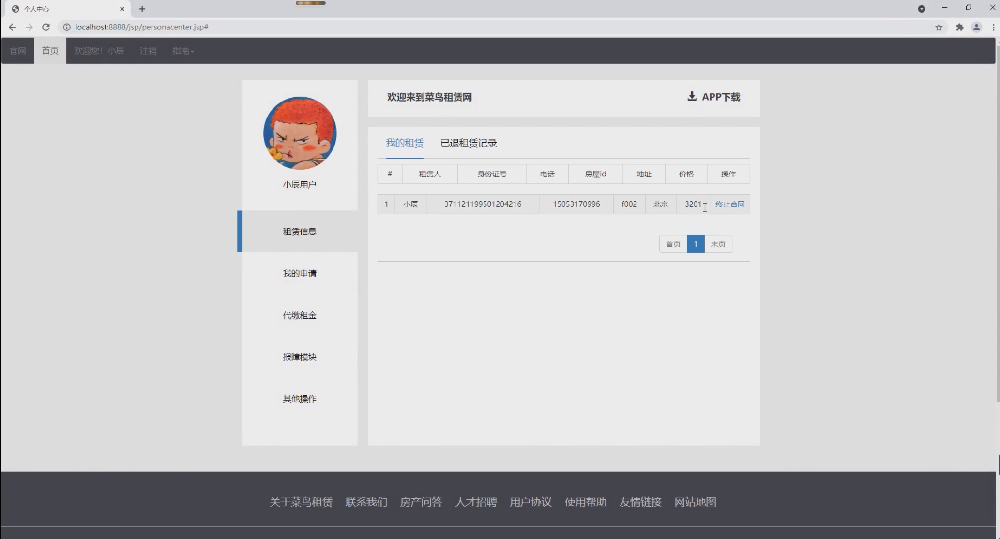
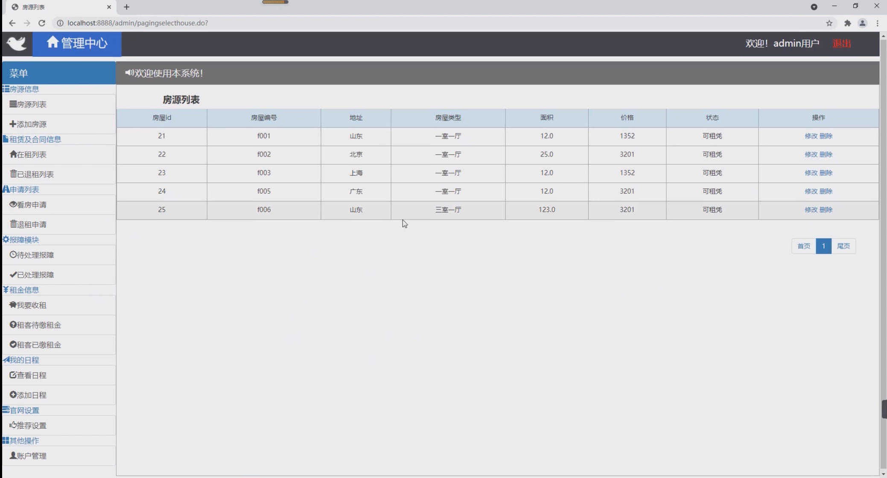
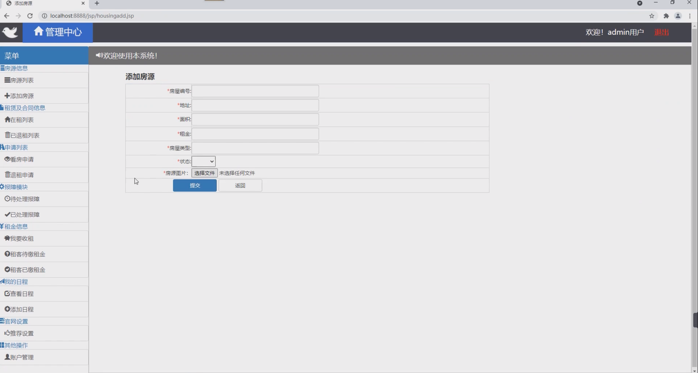
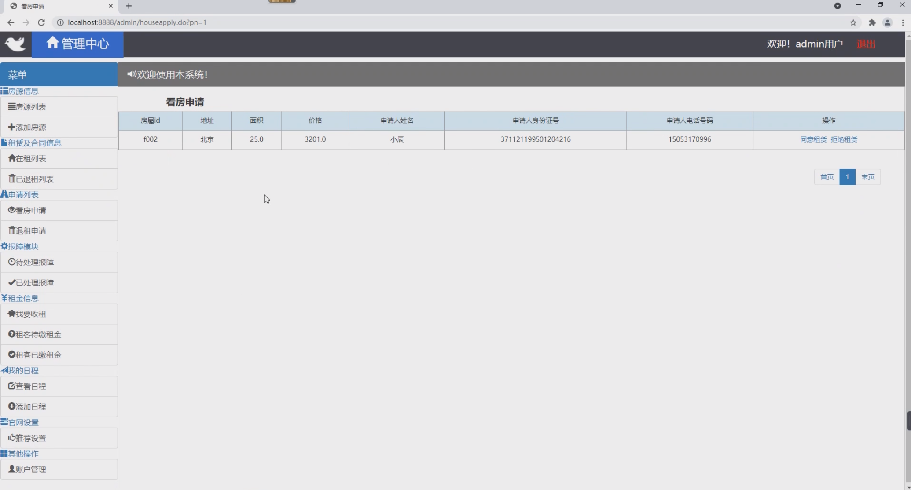
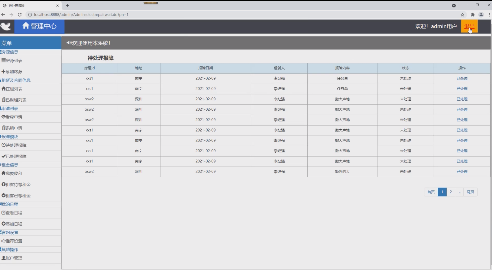
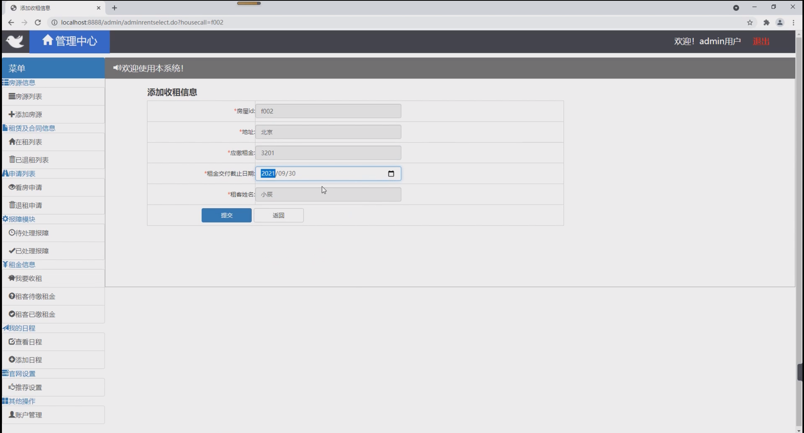

## 基于SSM框架的房屋租赁系统

- <b>完整代码获取地址：从戎源码网 ([https://armycodes.com/](https://armycodes.com/))</b>
- <b>技术探讨、资料分享，请加QQ群：692619798</b> 
- <b>作者微信：19941326836  QQ：952045282</b> 
- <b>承接计算机毕业设计、Java毕业设计、Python毕业设计、深度学习、机器学习</b>
- <b>选题+开题报告+任务书+程序定制+安装调试+论文+答辩ppt 一条龙服务</b>
- <b>所有选题地址 ([https://github.com/YuLin-Coder/AllProjectCatalog](https://github.com/YuLin-Coder/AllProjectCatalog)) </b>

## 项目介绍
基于SSM框架的房屋租赁系统，系统分为租客和管理员两个角色，主要功能如下
租客：
房源浏览、预约看房、关注房源、租赁信息、租赁申请信息、缴纳租金、报障模块

管理员：
房源信息：房源列表、添加房源
租赁及合同信息：在租列表、已退租列表
申请列表：看房申请、退租申请
报障模块：待处理报障、已处理报障
租金信息：我要收租、租客代缴租金、租客已缴租金
我的日程：查看日程、添加日程

## 项目技术
- 编程语言：Java
- 数据库：MySQL
- 前端技术：JSP、JavaScript、bootstrap、JQuery
- 后端技术：Spring、SpringMVC、MyBatis

## 运行环境
- JDK版本：JDK1.8及以上
- 开发工具：IDEA、Ecplise、Myecplise都可以
- 数据库: MySQL5.7及以上
- Maven：maven3.0及以上

## 运行截图

